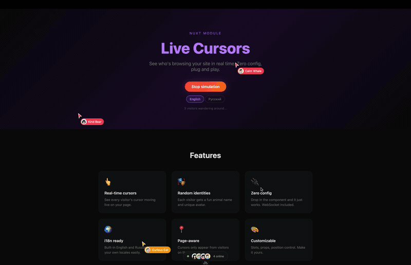

# nuxt-live-cursors

[![npm version][npm-version-src]][npm-version-href]
[![npm downloads][npm-downloads-src]][npm-downloads-href]
[![License][license-src]][license-href]
[![Nuxt][nuxt-src]][nuxt-href]

Real-time live cursors for Nuxt. Show other visitors on your site with avatars and random nicknames.

Built on Nitro WebSocket - zero external dependencies, no third-party services.



## Features

- Live cursor positions via WebSocket (syncs on both mouse move and scroll)
- Hide/show other cursors toggle in profile popover
- Random SVG avatars (powered by [@nextorders/avatar](https://github.com/nextorders/avatar))
- Built-in localization (English, Russian) with easy extension via PR
- Unique colors per visitor
- Online bar with visitor avatars
- Profile popover with shuffle button
- Auto-reconnect on disconnect
- Cursor filtering by current page
- Configurable via `nuxt.config.ts`
- Slots for full customization

## Setup

```bash
npx nuxi module add nuxt-live-cursors
```

Or install manually:

```bash
npm i nuxt-live-cursors
```

```ts
// nuxt.config.ts
export default defineNuxtConfig({
  modules: ['nuxt-live-cursors'],
})
```

## Usage

Add the component to your `app.vue`:

```vue
<template>
  <NuxtLayout>
    <NuxtPage />
  </NuxtLayout>
  <LiveCursors />
</template>
```

That's it. Cursors will appear automatically with English nicknames.

## Localization

Pass the `locale` prop to switch language:

```vue
<LiveCursors locale="ru" />
```

With `@nuxtjs/i18n`:

```vue
<LiveCursors :locale="locale" />

<script setup>
const { locale } = useI18n()
</script>
```

Built-in locales: `en`, `ru`. Unsupported locales fall back to English.

Want to add a language? Submit a PR with a new file in `src/runtime/locales/`.

## Configuration

```ts
// nuxt.config.ts
export default defineNuxtConfig({
  modules: ['nuxt-live-cursors'],
  liveCursors: {
    // WebSocket endpoint path (default: '/_live-cursors-ws')
    wsPath: '/_live-cursors-ws',
    // Avatar endpoint path (default: '/_live-cursors-avatar')
    avatarPath: '/_live-cursors-avatar',
    // Throttle interval in ms (default: 50)
    throttleMs: 50,
  },
})
```

## Composable

Use `useLiveCursors()` for custom implementations:

```ts
const {
  cursors, // other visitors' cursors on current page
  cursorsHidden, // ref<boolean> — toggle to hide/show other cursors
  onlineUsers, // all connected visitors
  onlineCount, // total count
  myId, // your unique ID
  myNameKey, // your nickname key (resolve via locales)
  myColor, // your cursor color
  myAvatar, // your avatar URL
  isConnected, // WebSocket connection status
  shuffle, // randomize your identity
} = useLiveCursors()
```

## Slots

The `<LiveCursors>` component provides slots for customization:

```vue
<LiveCursors locale="ru">
  <!-- Customize cursor name display -->
  <template #cursor-name="{ cursor }">
    {{ cursor.nameKey }}
  </template>

  <!-- Customize your name in profile -->
  <template #my-name>
    Custom Name
  </template>

  <!-- Customize profile actions -->
  <template #profile-actions="{ shuffle }">
    <button @click="shuffle">Randomize</button>
  </template>

  <!-- Customize online counter text -->
  <template #online-text="{ count }">
    {{ count }} visitors
  </template>
</LiveCursors>
```

## CSP

If you use Content-Security-Policy, add WebSocket to `connect-src`:

```
connect-src 'self' wss: ws:
```

## License

MIT

<!-- Badges -->
[npm-version-src]: https://img.shields.io/npm/v/nuxt-live-cursors/latest.svg?style=flat&colorA=18181B&colorB=28CF8D
[npm-version-href]: https://npmjs.com/package/nuxt-live-cursors

[npm-downloads-src]: https://img.shields.io/npm/dm/nuxt-live-cursors.svg?style=flat&colorA=18181B&colorB=28CF8D
[npm-downloads-href]: https://npmjs.com/package/nuxt-live-cursors

[license-src]: https://img.shields.io/github/license/hmbanan666/nuxt-live-cursors.svg?style=flat&colorA=18181B&colorB=28CF8D
[license-href]: https://github.com/hmbanan666/nuxt-live-cursors/blob/main/LICENSE

[nuxt-src]: https://img.shields.io/badge/Nuxt-18181B?logo=nuxt
[nuxt-href]: https://nuxt.com
